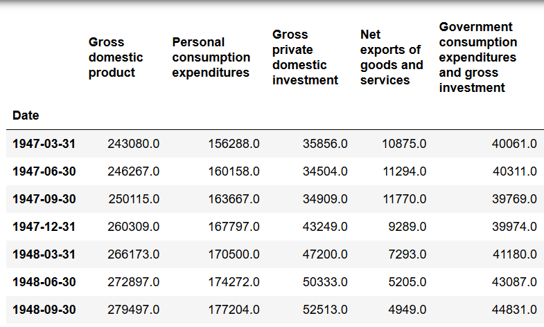
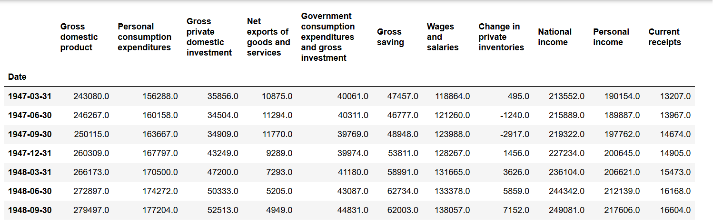
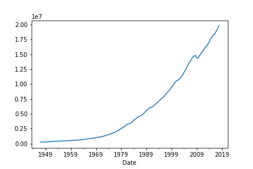
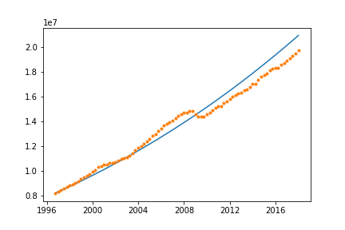
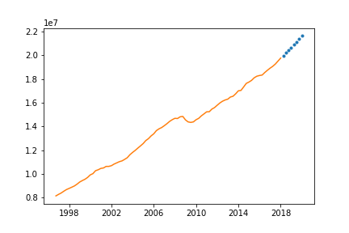
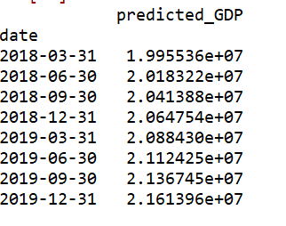

# GDP Prediction

Authors:  **Harsh Nisar**, **Ketul Patel**, **Shrinivas Phatale** and **Harsh Patel**.

YouTube Video: https://youtu.be/o5jeJwa04co

---

## Introduction

- Nominal GDP estimates are commonly used to determine the economic performance of a whole country or region, and to make international comparisons.
- GDP has large impact on people living in that economy. It affects their lifestyle, health, and also on the stock market. Study of different articles on GDP has led us to identify some of the factors affecting GDP such as national income, net exports, gross savings and salaries of the people, Government expenditure and investment, and the personal income.
- It is important to analyze the effect of the above mentioned factors on the GDP so as to predict the future performance of the economy and to take necessary measures to prevent a crisis in the future.
- For this analysis, we have imported the United States quarterly GDP data from quandl.
- Likewise, the columns have been taken from quandl according to their importance to the GDP.
- With this data, we’ll forecast the factors affecting the GDP and will predict the GDP based on the forecasted factors.
- For this we are using the ARIMA method for forecasting and Multivariate regression for predicting the future GDP.

---

## References

- The code retrieves data from
	1) https://www.quandl.com/data/BEA-Bureau-of-Economic-Analysis?keyword=BEA%2FT10105_Q
	2) https://www.quandl.com/data/BEA-Bureau-of-Economic-Analysis?keyword=BEA%2FT50100_Q
	3) https://www.quandl.com/data/BEA-Bureau-of-Economic-Analysis?keyword=BEA%2FT20200A_Q, 
	4) https://www.quandl.com/data/BEA-Bureau-of-Economic-Analysis?keyword=BEA%2FT20200B_Q
	5) https://www.quandl.com/data/BEA-Bureau-of-Economic-Analysis?keyword=BEA%2FT50705A_Q
	6) https://www.quandl.com/data/BEA-Bureau-of-Economic-Analysis?keyword=BEA%2FT50705B_Q
	7) https://www.quandl.com/data/BEA-Bureau-of-Economic-Analysis?keyword=BEA%2FT11200_Q
	8) https://www.quandl.com/data/BEA-Bureau-of-Economic-Analysis?keyword=BEA%2FT20100_Q
	9) https://www.quandl.com/data/BEA-Bureau-of-Economic-Analysis?keyword=BEA%2FT30300_Q
- Inspiration for working on the GDP data:
	1) The Greek Financial Crisis (2009-2016) https://www.econcrises.org/2017/07/20/the-greek-financial-crisis-2009-2016/
	2) U.S. Economic Crisis History and Warning Signs https://www.thebalance.com/u-s-economic-crisis-3305668
- Used the following references for coding:
	1) https://pandas.pydata.org/pandas-docs/stable/api.html
	2) https://stackoverflow.com/
	3) https://elitedatascience.com/python-cheat-sheet 
	4) https://nycdatascience.com/blog/student-works/forecasting-economic-risk-eu-2020/ 
	5) http://scikit-learn.org/stable/modules/classes.html
	6) https://towardsdatascience.com/time-series-analysis-in-python-an-introduction-70d5a5b1d52a
	7) https://stats.stackexchange.com/questions/313896/best-forecasting-model-for-time-series-analysis-on-small-dataset
	8) https://medium.com/dunder-data/selecting-subsets-of-data-in-pandas-6fcd0170be9c
	9) https://stackoverflow.com/questions/10678496/creating-a-list-using-a-date-as-index
	10) https://elitedatascience.com/python-machine-learning-tutorial-scikit-learn
	11) http://pyramid-arima.readthedocs.io/en/latest/_submodules/arima.html?highlight=fit%20predict%20n_periods
	12) http://pyramid-arima.readthedocs.io/en/latest/_submodules/arima.html#pyramid.arima.auto_arima
	13) https://github.com/tgsmith61591/pyramid

---

## Requirements

- We need to install the following packages/libraries for running the code successfully:
	1) Pandas
	2) Quandl
	3) Pyramid-arima
- Procedure for installing Pandas and Quandl libraries:
	1) Open terminal window
	2) Write ‘pip install pandas’ and press enter
	3) Write ‘pip install quandl’ and press enter
	4) Write 'pip install pyramid-arima' and press enter. If you encounter an import error, try updating numpy and reinstall it. Outdated numpy versions have been observed to break the pyramid build.
- We also need to create a quandl account to get the API key to access quandl data.
- Steps to create quandle account and getting API key
	1) Go to qaundl site - https://www.quandl.com/
	2) Create account with sign up
	3) Provide your name and select purpose as per requirement
	4) On next page provide the requested information and click on the Next button
	5) Create your password and click on Next button to generate the account
	6) You can get your API key in the Account Settings tab

---

## Explanation of the Code

**Importing of Necessary Packages**
- Our code, `needs_a_good_name.py`, begins by importing the following Python packages after installing Pandas and Quandl libraries:
	```
	import matplotlib.pyplot as plt
	import quandl
	import numpy as np
	import pandas as pd
	from sklearn import linear_model
	from pyramid.arima import auto_arima
	from sklearn.metrics import mean_squared_error, r2_score
	from pandas.tools.plotting import lag_plot
	from pandas.tools.plotting import autocorrelation_plot
	from sklearn import preprocessing
	```
- To access the quandl data, the API key which is generated after creating a quandl account has to be mentioned in the code. 	
	```
	#use your API key
	quandl.ApiConfig.api_key = "eWQyiDgtMtFJ6YgJkAkB"
	```
	
**Data Import from Online source using API**
- We first import the GDP data from Quandl.
	```
	df = quandl.get('BEA/T10105_Q')
	```
- The data is then converted to pandas dataframe. We print the data to allow us to verify what we've imported.
	```
	df1 = pd.DataFrame(df)
	print df1
	```
- By observing the data, we found that there are main factors and their sub factors. For analysis purposes, we decided to consider only the main factors as they are calculated from sub factors itself. So the overall effect would be the same.
	```
	l = list (df1.columns)

	a = []
	for i in l:
    	 if(i[0] != ':'):
          a.append(i)
	  
	df2 = df1.loc[:,a]
	```

- In the above created dataframe df2, we have added other factors like Gross saving, Wages and salaries, National income, etc. in separate columns to analyze their effect on GDP. 
	```
	df2['Gross saving'] = quandl.get('BEA/T50100_Q')['Gross saving']
	b = quandl.get('BEA/T20200A_Q')[['Wages and salaries']]
	c = quandl.get('BEA/T20200B_Q')[['Wages and salaries']]
	d = quandl.get('BEA/T50705A_Q')[['Change in private inventories']]
	e = quandl.get('BEA/T50705B_Q')[['Change in private inventories']]
	df2['Wages and salaries'] = pd.concat([b,c])
	df2['Change in private inventories'] = pd.concat([d,e]).drop_duplicates()
	df2['National income'] = quandl.get('BEA/T11200_Q')[['National income']]
	df2['Personal income'] = quandl.get('BEA/T20100_Q')[['Personal income']]
	df2['Current receipts'] = quandl.get('BEA/T30300_Q')[['Current receipts']]
	```


**Data Cleaning**
- We then checked the data for any null values and removed them
	```
	df2.isna()
	df2.notnull()
	df2 = df2.dropna()
	```
- We check the coorelation of all the factors with eachother and with the GDP.
	```
	df2.corr()
	```

**Data Visualization**
- We create different plots of the GDP data to get visual insights. The lineplot indicates there is a trend.
	```
	df2['Gross domestic product'].plot()
	plt.show()
	```


**Splitting data into train and test data**
- The data has been split as response and predictors as shown below:
	```
	y  =  df2['Gross domestic product']                  #response
	x = df2.drop(['Gross domestic product'], axis = 1)   #predictors
	```
- The train size is taken as 70% of the overall data.
	```
	train_size = int(len(x)*0.70)
	train_x,test_x = x[0:train_size],x[train_size:len(x)]
	train_y,test_y = y[0:train_size],y[train_size:len(x)]
	```
- To know the number of observations, training observations and testing observations, we have used the following code.
	```
	print('Observations: %d' % (len(x)))
	print('Training Observations: %d' % (len(train_x)))
	print('Testing Observations: %d' % (len(test_x)))
	```
	
**Fitting a model**
- A linear model is fitted using the training data.
	```
	lm = linear_model.LinearRegression()
	model = lm.fit(train_x,train_y)
	```
- The model is then used on the test data to predict the response values. 
	```
	predictions_test = lm.predict(test_x)
	```
- We then find the R^2 value to determine the accuracy of the model.
	```
	r2_score_test = r2_score(test_y,predictions_test)
	```
	
**ARIMA Analysis**
- ARIMA is applied on all the predictors to forecast the test values of the predictors. We have used auto arima which performs ARIMA on different values of (p,d,q) and takes those set of values which give the least mean square error. 
	```
	pred = pd.DataFrame(index=test_y.index)
	MAPE_pred = []
	MAE_pred = []

	for i in train_x.columns:
    	   stepwise_fit = auto_arima(train_x[i],error_action = 'ignore',trend ='t')
    	   next_test = stepwise_fit.predict(n_periods = len(test_x))
    	   pred[i] = next_test
    	   MAPE_pred.append(MAPE(next_test,test_x[i]))
    	   MAE_pred.append(MAE(next_test,test_x[i]))
    	```
- The forecasted test values of the predictors are then used to predict the test values of the response variable (GDP) using the linear model created before. We then check the mean square error and mean absolute percent error using the predicted and the actual test values of the GDP.
	```
	predictions = pd.DataFrame(index=test_y.index)
	predictions['prectied_GDP'] = lm.predict(pred)
	print mean_squared_error(test_y,predictions)
	print r2_score(test_y,predictions)
	print MAPE(test_y,predictions['prectied_GDP'])

	stepwise_fit.summary()
	```
	
**Predicted vs actual plot for test data**
- The following code gives the plot of predicted vs actual test values.
	```
	plt.plot(predictions['predicted_GDP'],'-',test_y,'.')
	plt.show()
	```


**Prediction for the next 2018 and 2019 GDP value**
- Since we have data till 31st December,2017, we have to create new indexes (rows) for the next two years inorder to store the predicted values. 
	```
	pred2= pd.DataFrame()
	date = ['2018-03-31', '2018-06-30', '2018-09-30','2018-12-31','2019-03-31', '2019-06-30', '2019-09-30','2019-12-31']
	pred2['date'] = date
	pred2['date'] = pd.to_datetime(pred2['date'], infer_datetime_format=True)
	pred2.index = pred2['date']
	```
- We have created a separate dataset pred1 to store the predicted values of GDP for the next two years.
	```
	pred1 = pred2.drop(['date'], axis = 1)
	for i in test_x.columns:
	    stepwise_fit = auto_arima(test_x[i],error_action = 'ignore',trend ='t')                            
	    next_8 = stepwise_fit.predict(n_periods = 8)                                            
	    pred1[i] = next_8
	```
- New pandas dataframe created with index values and predicted values from the above two dataframes. Plot created using the initial test values and the predicted values of GDP of the next two years
	```
	predictions_2year = pd.DataFrame(index = pred1.index)  
	predictions_2year['predicted_GDP'] = lm.predict(pred1)

	plt.plot(predictions_2year,'.',test_y,'-')            
	plt.show()
	```


---

## How to Run the Code

1. Ensure that you have registered for the Quandl API key. You can do so by refering the steps provided in the point 3 under Requirements heading of this document.

2. Ensure that you have installed necessary Python packages and libraries. 
	1) Pandas
	2) Quandl
	3) Pyramid-arima

3. Open a terminal window.

4. Change directories to where `GDP_Prediction.py` is saved.

5. Type the following command:
	```
	python GDP_Prediction.py
	```

---

## Results from our Analysis
- We developed a GDP prediction model from the factors using multivariate linear regression and ARIMA analysis. The R^2 value that we get is 95.38% which means that our model explains 95.38% of variability in the data. Also MAPE of the test data is 3.68% which shows the accurate prediction by the model.
- We have predicted the GDP values for the next two years as shown below:


